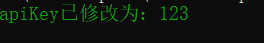
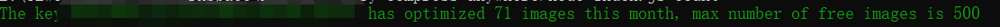
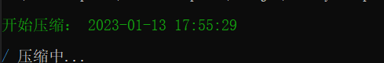
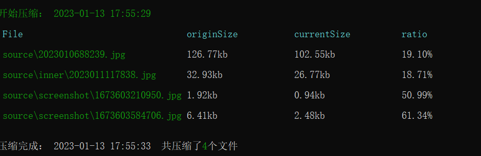

# tinify-compress-anywhere

[](https://github.com/JadeXusq/tinify-compress-anywhere/actions?query=workflow%3A%22build%22)
[](https://www.npmjs.org/package/tci)
[](https://npmcharts.com/compare/tci?minimal=true)
[](https://packagephobia.now.sh/result?p=tci)

Read this in other languages: English | [简体中文](./Readme_zh-CN.md)

## Introduction

compress image files from anywhere to anywhere with tinify plugin

## Installation

```sh
npm install tci -g
```

## Check Version

check `tci` plugin version

```sh
tci -V
```

## Set Key

set apiKey of what is Authentication to the API is done with HTTP Basic Auth of tinify. [fetch address](https://tinify.com/dashboard/api)

```sh
tci setKey apiKey
```




## Get Count

Get info about how much images the API key already optimized this month.

```sh
tci count
```



## compress images

use tinify to compress your images.

simple compress, default source name is `./source`, default output name is `./output`

```sh
tci
```

use relative path

```sh
tci -s ./source -o ./output
```

use absolute path

```sh
tci -s E:\tinify-compress-anywhere\source -o E:\tinify-compress-anywhere\output
```

cover current path file, just use the same path

```sh
tci -s ./source -o ./source
```

before the compression, copy the origin files to copyPath

```sh
tci -s ./source -o ./source -c ./copy
```




