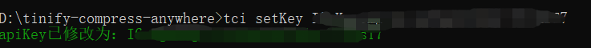
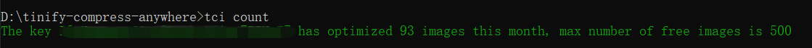
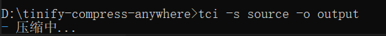
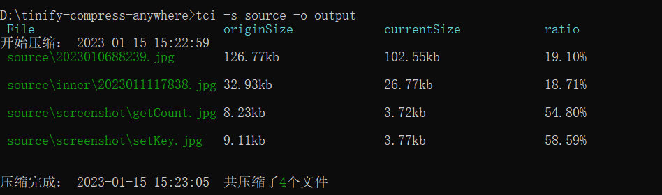

# tinify-compress-anywhere

[](https://www.npmjs.org/package/tinify-compress-anywhere)
[](https://npmcharts.com/compare/tinify-compress-anywhere?minimal=true)
[](https://packagephobia.now.sh/result?p=tinify-compress-anywhere)

Read this in other languages: [English](./README.md) | 简体中文

## 简介

使用Tinify插件将图像文件从指定文件夹压缩到指定文件夹

## 安装

```sh
npm install tci -g
```

## 检查版本

检查 `tci` 插件版本

```sh
tci -V
```

## 设置key

设置tinify提供的用于授权的apiKey. [获取地址](https://tinify.com/dashboard/api)

```sh
tci setKey apiKey
```



## 获取总数

获取有关本月 API 密钥已优化多少图像的信息.

```sh
tci count
```



## 压缩图片

使用 Tinify 压缩图像.

简单压缩, 默认资源文件目录为 `./source`, 输入目录为 `./output`

```sh
tci
```

使用相对路径

```sh
tci -s ./source -o ./output
```

使用绝对路径

```sh
tci -s E:\tinify-compress-anywhere\source -o E:\tinify-compress-anywhere\output
```

要覆盖当前文件夹，传入相同路径即可

```sh
tci -s ./source -o ./source
```

指定压缩前拷贝文件输出目录

```sh
tci -s ./source -o ./source -c ./copy
```




