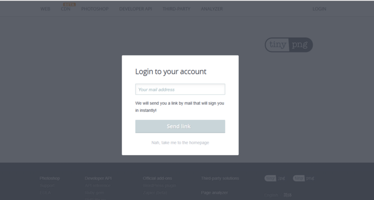
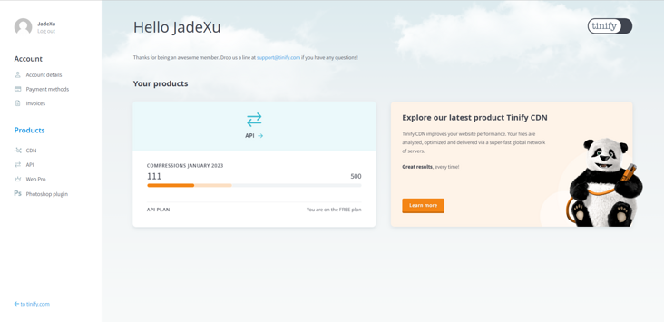
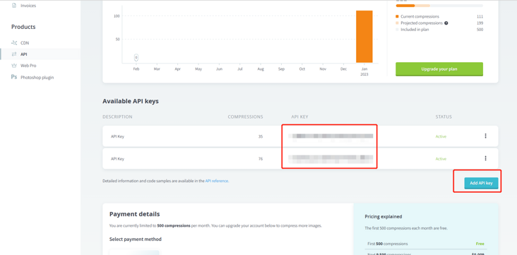
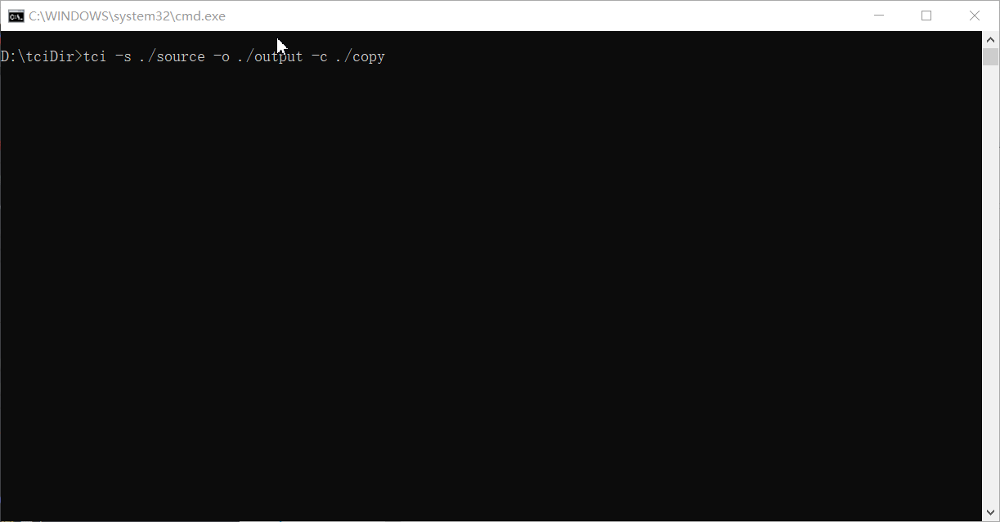
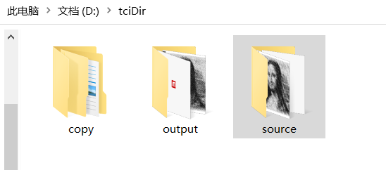

# tinify-compress-anywhere

[](https://www.npmjs.org/package/tinify-compress-anywhere)
[](https://npmcharts.com/compare/tinify-compress-anywhere?minimal=true)
[](https://packagephobia.now.sh/result?p=tinify-compress-anywhere)

Read this in other languages: [English](./README.md) | 简体中文

## 简介

tinify-compress-anywhere库是一个使用Tinify插件将图像文件从指定文件夹压缩到指定文件夹的第三方库，实现了多级目录接口下的图片全压缩。

## 安装插件

```sh
npm install tinify-compress-anywhere -g
```

## 检查插件版本

检查 `tci` 插件版本

```sh
tci -V
```

## 设置key

[获取地址](https://tinify.com/dashboard/api)

先通过邮箱注册登录一个账号



登录后，点击用户名进入到个人首页



点击侧边栏api菜单，进入创建或复制apiKey



以上就是注册获取apiKey的方法，获取到apiKey之后，通过下面的命令设置tci插件使用的apiKey

```sh
tci setKey apiKey
```


## 获取总数

获取有关本月 API 密钥已优化多少图像的信息.

```sh
tci count
```


## 压缩图片

使用 Tinify 压缩图像.

简单压缩, 默认资源文件目录为 `./source`, 输入目录为 `./output`

```sh
tci
```

使用相对路径

```sh
tci -s ./source -o ./output
```

使用绝对路径

```sh
tci -s E:\tinify-compress-anywhere\source -o E:\tinify-compress-anywhere\output
```

要覆盖当前文件夹，传入相同路径即可，（ps. 可引用到自己的项目中，通过配置指令，实现打包发布前提前对图片资源进行压缩）

```sh
tci -s ./source -o ./source
```

指定压缩前拷贝文件输出目录（ps. 为了确保原图片安全性，可指定拷贝路径，该插件会在指定的拷贝路径下按时间戳存放的形式对图片进行拷贝）

```sh
tci -s ./source -o ./source -c ./copy
```

## 效果展示



